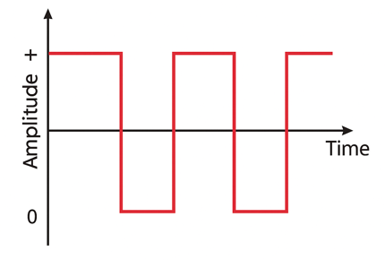

# CS Hardware - Day 4

## Wave

---

# Goal For Today

By the end of today you will:

- Understand what an Integrated Circuit (IC) is
- Learn how the 555 Timer IC creates oscillations
- Use an oscilloscope to visualize signals
- Build a simple electric piano circuit
- Connect waves to sound and communication

---

# Review From Day 3

Yesterday we learned:

- Capacitors store charge
- RC circuits create timing
- Oscillators repeatedly switch ON/OFF
- Frequency is measured in Hertz (Hz)
- Computers depend on timing circuits

---

# Review From Day 2

We also learned:

- Transistors act like switches
- Logic gates create binary decisions
- Modern CPUs contain billions of transistors

---

# Today

Today we add a new idea: **WAVES**

Electrical signals can:

- repeat
- oscillate
- carry information
- create sound

---

# Today's Workflow

1. Learn what an IC is
2. Explore the 555 Timer
3. Observe waves with an oscilloscope
4. Build a sound circuit
5. Connect waves to communication

---

# Before Integrated Circuits

Early electronics required:

- many individual transistors
- huge amounts of wiring
- large physical size
- high failure rates

---

# Integrated Circuit (IC)

An Integrated Circuit combines many components into one chip.

An IC may contain:

- transistors
- resistors
- capacitors
- logic circuits

<!--

INSTRUCTOR NOTES:

Compare:
- discrete breadboard circuits
- modern chips

A modern CPU is an extremely advanced IC.

-->

---

# Why ICs Changed Everything

Integrated circuits made electronics:

- smaller
- faster
- cheaper
- more reliable
- more power efficient

---

# The 555 Timer IC

One of the most famous ICs ever made.

The 555 Timer can act as:

- timer
- oscillator
- pulse generator
- tone generator

---

# Why Is It Called "555"?

The original chip used:

- three 5kΩ resistors internally

5k + 5k + 5k = 555

<!--

INSTRUCTOR NOTES:

Do NOT explain every internal transistor.

Main idea:
ICs package huge complexity into reusable building blocks.

-->

---

# 555 Timer Modes

The 555 Timer has several operating modes:

- Monostable (one pulse)
- Bistable (flip-flop)
- Astable (continuous oscillation)

Today we focus on: **Astable Mode**

---

# Oscillation

An oscillator repeatedly changes between:

- HIGH voltage
- LOW voltage

This creates a repeating electrical wave.

---

# Square Wave

A square wave rapidly switches:

- ON
- OFF
- ON
- OFF

This is extremely important in computing.

---

# Frequency

Frequency tells us how fast a signal repeats.

Measured in Hertz (Hz)

- 1 Hz = 1 cycle per second
- 440 Hz = musical note A
- GHz = billions of cycles per second

---

# Waves Are Everywhere

Many technologies use oscillating signals:

- music
- radio
- WiFi
- Bluetooth
- CPUs
- HDMI
- USB

---

# Computers Use Waves Too

Computers constantly generate timing signals.

Examples:

- CPU clocks
- USB communication
- audio signals
- display signals

---

# Demo: 555 Timer LED Blinker

The 555 repeatedly charges and discharges a capacitor.

This creates:

- timing
- pulses
- blinking LEDs

<!--

INSTRUCTOR NOTES:

Connect this back to Day 3 RC circuits.

Key insight:
The 555 automates the oscillation process.

-->

---

# What Controls Blink Speed?

Timing depends on:

- resistor values
- capacitor values

Larger values → slower oscillation

Smaller values → faster oscillation

---

# Oscilloscope

An oscilloscope lets us SEE electrical signals.

It displays:

- voltage
- time
- wave shape
- frequency

---

# Why Oscilloscopes Matter

Many signals change too fast to see directly.

Oscilloscopes help engineers debug:

- clocks
- sensors
- sound
- communication systems
- computer hardware

---

# Demo: Reading A Wave

Observe on the oscilloscope:

- voltage rising/falling
- repeating square wave
- changing frequency

<!--

INSTRUCTOR NOTES:

Point out:
- horizontal axis = time
- vertical axis = voltage

Ask:
- What changes when frequency increases?
- What changes when resistance changes?

-->

---

# Sound Is A Wave

Speakers convert electrical waves into sound waves.

Faster oscillation → higher pitch

Slower oscillation → lower pitch

---

# Piezo Speaker

A piezo speaker vibrates rapidly when voltage changes.

Rapid vibration creates sound waves in air.

---

# Demo: Electronic Piano

Build a simple tone generator using:

- 555 timer
- resistors
- capacitors
- buttons
- speaker

:contentReference[oaicite:0]{index=0}

---

# Demo: Changing Pitch

Changing resistance or capacitance changes:

- oscillation speed
- frequency
- sound pitch

<!--

INSTRUCTOR NOTES:

Students should hear:
- lower resistance → faster oscillation
- faster oscillation → higher pitch

Connect directly to music and instruments.

-->

---

# Lab Breakout #1

## 555 Timer Oscillator

Goal:

- Build a blinking LED oscillator
- Change timing components
- Observe frequency changes

---

# Lab Breakout #2

## Electronic Piano

Goal:

- Build a simple tone generator
- Change pitch using buttons/resistors
- Observe waveform on oscilloscope

---

# Power vs Signal

Some wires provide POWER.

Some wires provide INFORMATION.

| Wire Type | Purpose |
| --- | --- |
| Power (+) | delivers energy |
| Ground (-) | return/reference |
| Signal/Data | carries information |

---

# Binary Signals

Digital electronics use changing voltage levels.

| Voltage | Meaning |
| --- | --- |
| LOW | 0 |
| HIGH | 1 |

By rapidly changing between HIGH and LOW, circuits can send information.

---

# Modern Electronics Use Signals

Devices communicate using electrical signals:

- USB
- HDMI
- Ethernet
- WiFi
- Bluetooth
- audio

Modern computers constantly send and receive waves.

---

# Everything Connects

Days 1–4 together:

- Voltage pushes current
- Transistors control switching
- Capacitors control timing
- Oscillators create waves
- Waves carry sound and data

---

# Debugging Oscillator Circuits

If your circuit does NOT work:

- verify IC orientation
- check capacitor polarity
- inspect loose wires
- verify power rails
- test speaker separately
- verify resistor values

Timing circuits can fail subtly.

---

# Key Takeaways

<!--

- ICs combine many components into one chip
- The 555 Timer is a classic oscillator IC
- Oscilloscopes visualize electrical signals
- Oscillators generate repeating waves
- Frequency controls timing and sound pitch
- Digital systems use changing voltage signals
- Modern computers constantly generate and interpret waves

-->