# CS Hardware - Day 4

## Wave

---

# Goal For Today

By the end of today you will:

- Understand what an Integrated Circuit (IC) is
- Create oscillations with the 555 Timer IC
- Use a multimeter + oscilloscope to measure wave frequency
- Connect waves to sound and communication

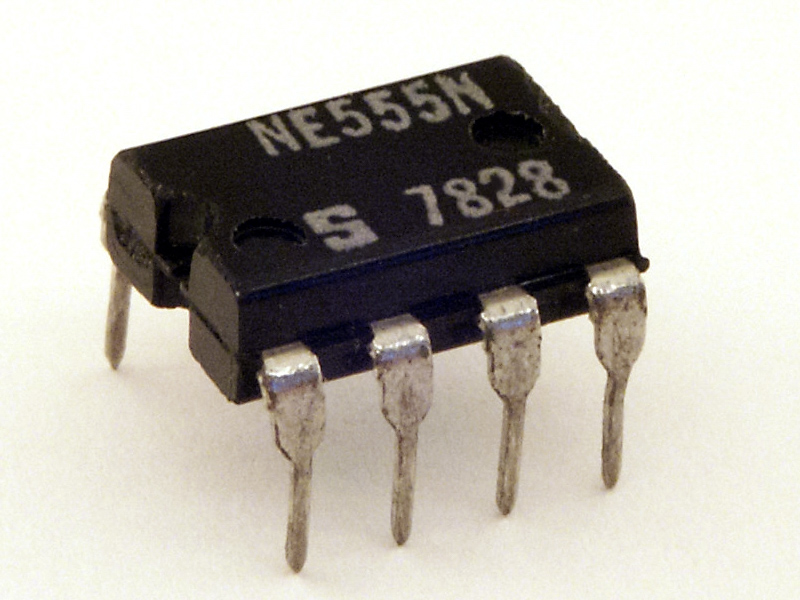

---

# Review From Day 3

Yesterday we learned:

- Capacitors store charge
- Resistor Capacitor (RC) circuits create timing
- Oscillators repeatedly switch ON/OFF
- Frequency is measured in Hertz (Hz)
- Computers depend on timing circuits

---

# Review From Day 2

We also learned:

- Transistors act like valves / switches
- Logic gates create binary decisions
- Modern CPUs contain billions of transistors

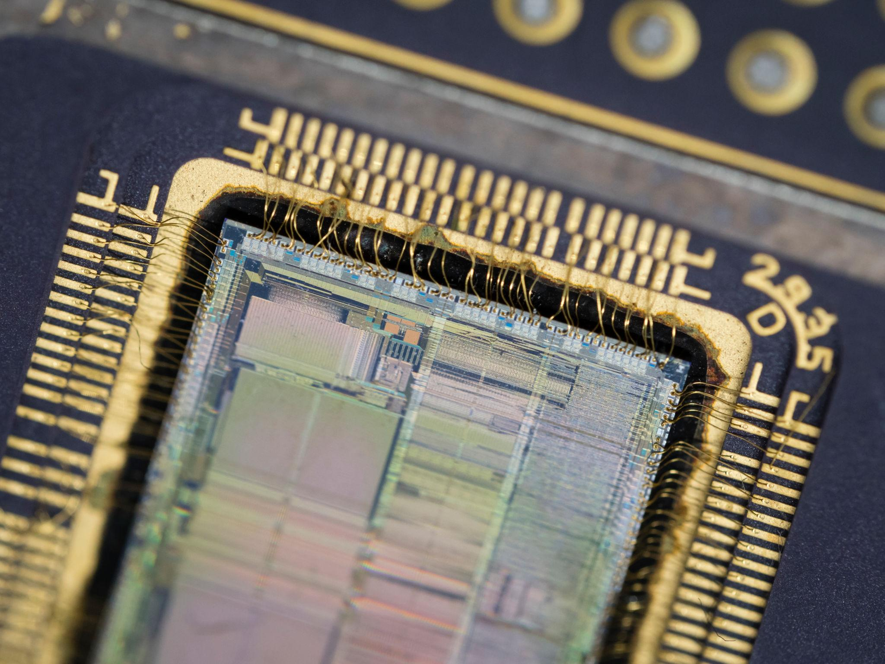

---

# Today

Today we add a new idea: **WAVES**

Electrical signals can:

- repeat
- oscillate
- carry information
- create sound

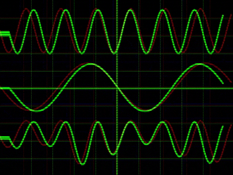

---

# Today's Workflow

1. Learn what an integrated circuit (IC) is
2. Explore the 555 Timer
3. Observe waves with an oscilloscope + multimeter
4. Build a sound circuit
5. Connect waves to communication

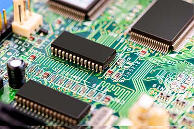

---

# Some History

By the 1950s engineers had transistors. The problem was connecting thousands of them.

- Too many wires
- Many failures
- Expensive

<!-- INSTRUCTOR NOTES

The Tyranny of Numbers 

Discrete transistors were a feature of logic design for computers from about 1960, when reliable transistors became economically available, until monolithic integrated circuits displaced them in the 1970s.

-->

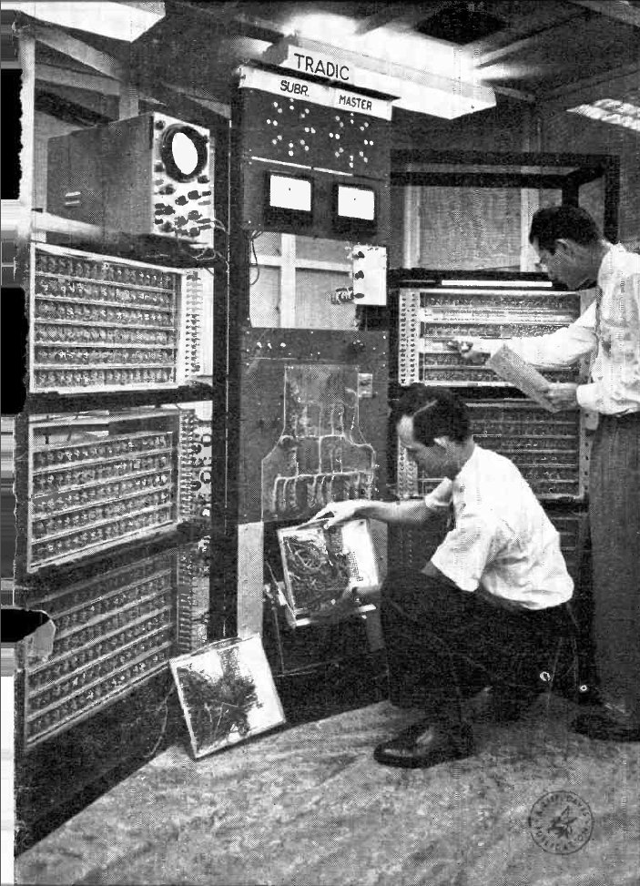

---

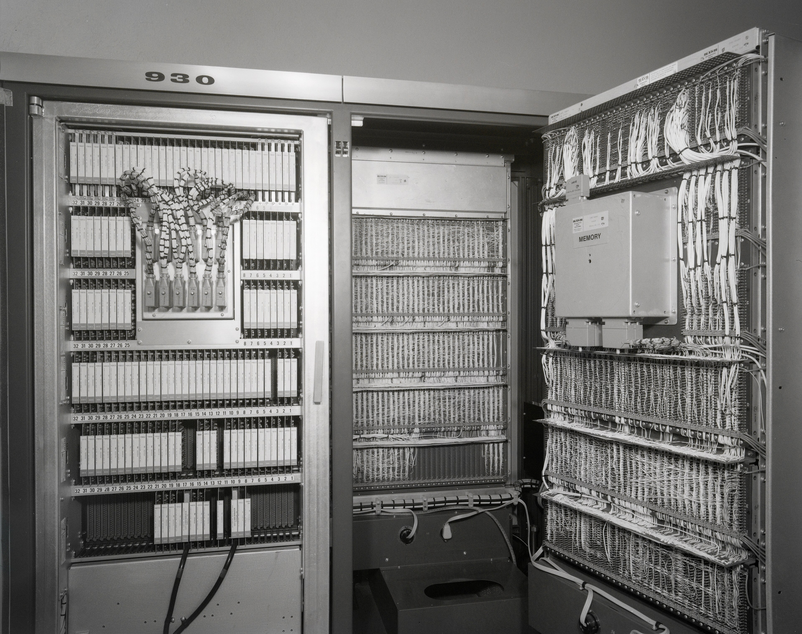

---

# Solution

Put the entire circuit on one semiconductor chip.

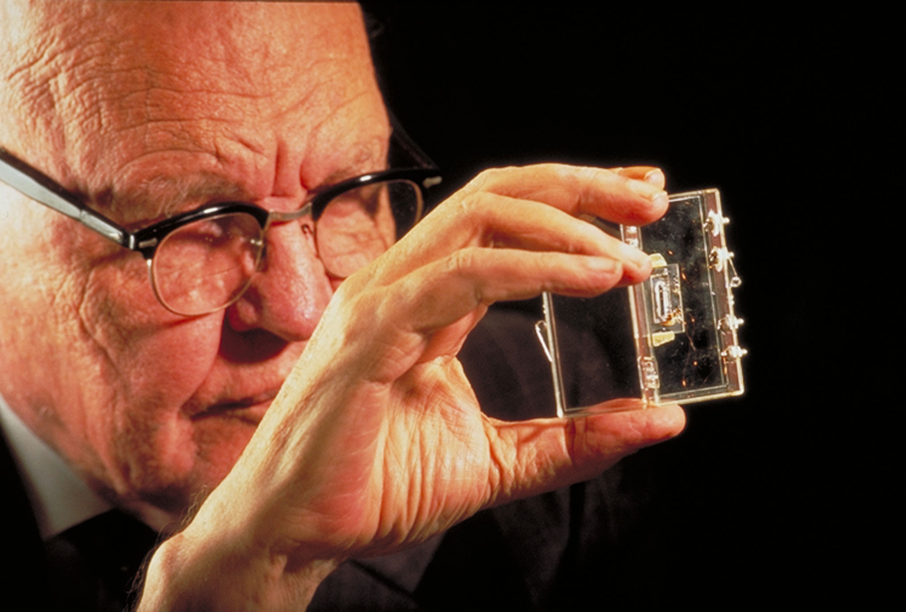

<!-- INSTRUCTOR NOTES:

This is the birth of the Integrated Circuit (IC).

Modern CPUs contain billions of transistors integrated onto a single chip.

A chip is a tiny electronic circuit built on a piece of silicon, which is a semiconductor.

Jack Kilby built the first prototype of an IC while working at Texas Instruments.

-->

---

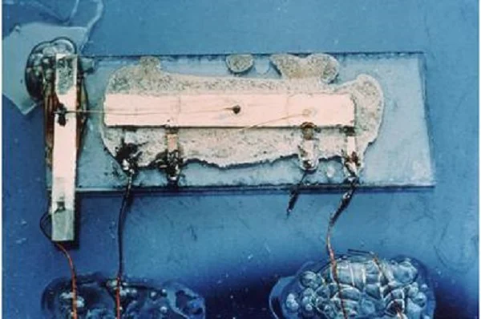

<!-- INSTRUCTOR NOTES:

September 1958
His device demonstrated that multiple electronic components could be fabricated on a single piece of semiconductor material.
The prototype used germanium and relied on wire connections.

-->

---

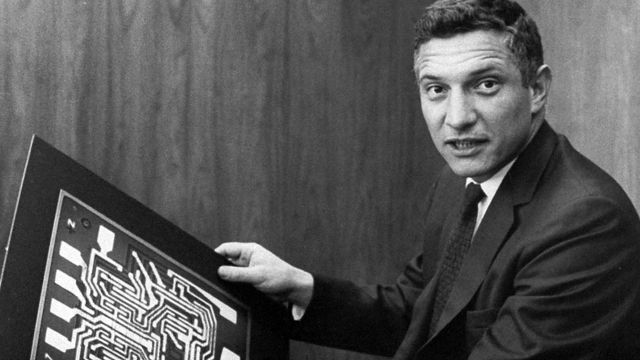

<!-- INSTRUCTOR NOTES:

At Fairchild Semiconductor, Noyce independently conceived a more practical version in 1959.
His design used silicon and the planar manufacturing process developed by Jean Hoerni.
Crucially, it incorporated metal interconnects directly on the chip, making mass production feasible.
Modern integrated circuits are much closer to Noyce's implementation than to Kilby's original prototype.

He later went on to found Intel

-->

---

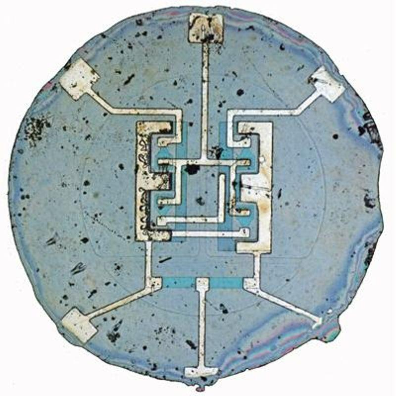

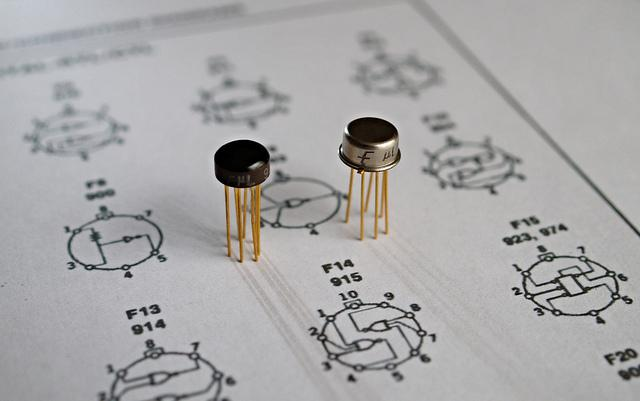

<!-- INSTRUCTOR NOTES

the first major customer for these early ICs was the U.S. military, especially for missile and space programs.
Civilian electronics did not become a large IC market until later in the 1960s, as prices fell and reliability improved.

-->

---

# What Is A Semiconductor?

| Material | Electricity | Example |
| -------- | ----------- | ------- |
| Conductors | Let electricity flow easily | Copper, Aluminum, Water with salt |
| Insulators | Block electricity | Rubber, Plastic, Wood, Glass |
| Semiconductor | in between | Silicon, Germanium |

<!-- INSTRUCTOR NOTES

You can "dope" semiconductor material to make it n-type (extra electrons), or p-type (electron shortage), so you can control the flow

-->

---

# Integrated Circuit (IC)

An Integrated Circuit combines many components into one chip.

- transistors
- resistors
- capacitors
- logic circuits

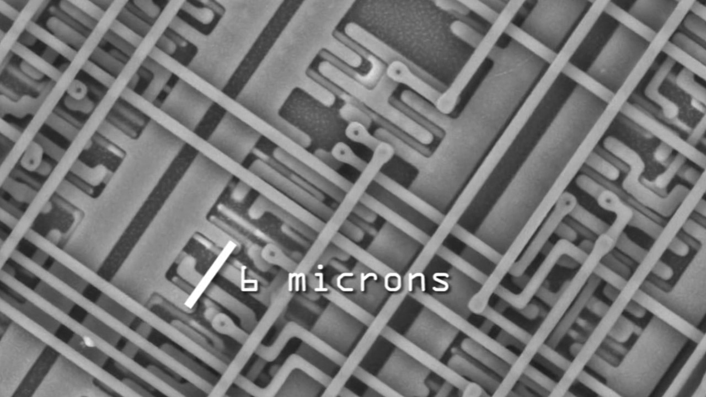

<!-- INSTRUCTOR NOTES

1 micron is one millionth of a meter

-->

---

# Why ICs Changed Everything

Integrated circuits made electronics:

- smaller
- faster
- cheaper
- more reliable
- more power efficient

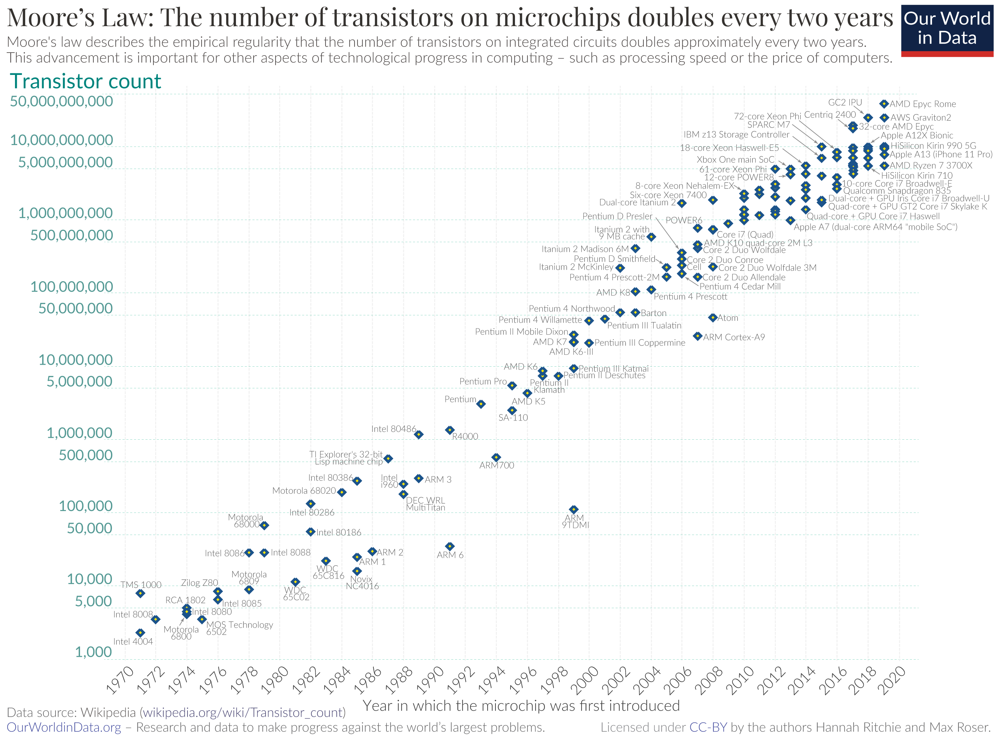

<!-- INSTRUCTOR NOTES

An observation that the number of transistors on a microchip roughly doubles every 2 years whereas it's cost is halved over the same time

Gordon Moore, the co-founder of Fairchild Semiconductor and Intel 

-->

---

# The 555 Timer IC

One of the most famous ICs ever made.

The 555 Timer can act as:

- timer
- oscillator
- pulse generator
- tone generator

<!-- 

Originally produced over 50 years ago
Billions made, used in all sorts of products

-->

---

# Why Is It Called "555"?

The original chip used:

- three 5kΩ resistors internally

5k + 5k + 5k = 555

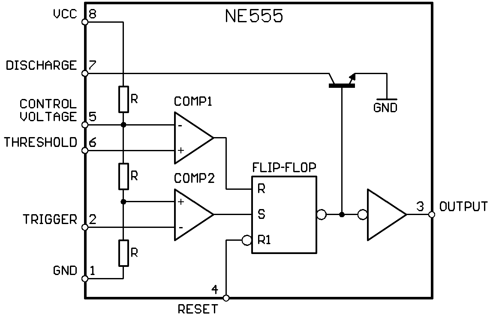

<!--

INSTRUCTOR NOTES:

Do NOT explain every internal transistor.

Main idea:
ICs package huge complexity into reusable building blocks.

-->

---

# 555 Timer Modes

The 555 Timer has several operating modes:

- Monostable (one pulse)
- Bistable (flip-flop)
- Astable (continuous oscillation)

Today we focus on: **Astable Mode**

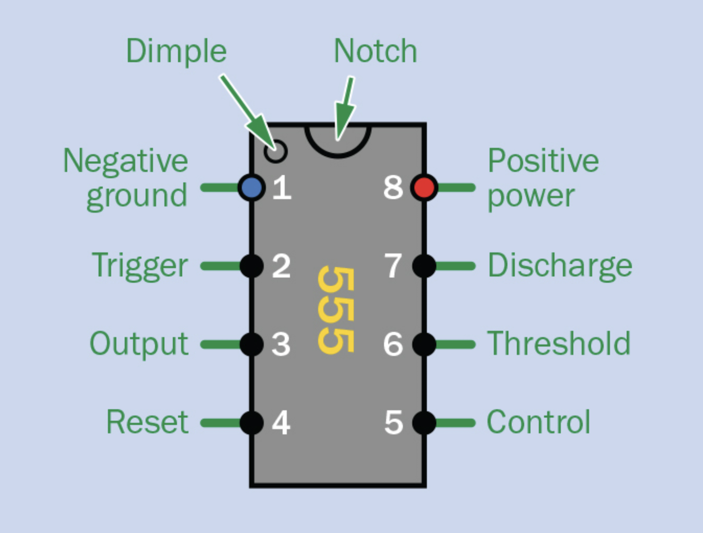

---

# Oscillation

An oscillator repeatedly changes between:

- HIGH voltage
- LOW voltage

This creates a repeating electrical wave.

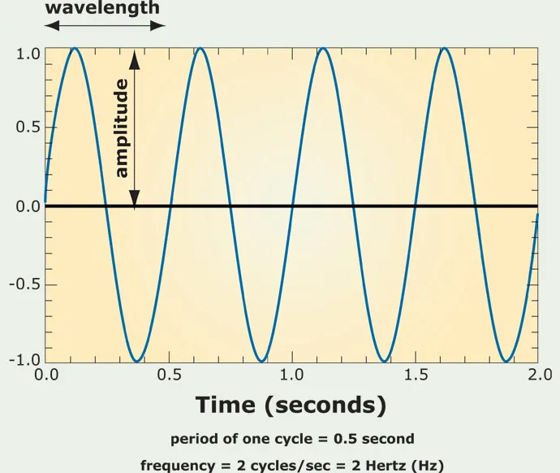

---

# Square Wave

A square wave rapidly switches:

- ON
- OFF
- ON
- OFF

---

# Frequency

Frequency tells us how fast a signal repeats.

Measured in Hertz (Hz)

- 1 Hz = 1 cycle per second
- 440 Hz = musical note A
- GHz = billions (10^9) of cycles per second

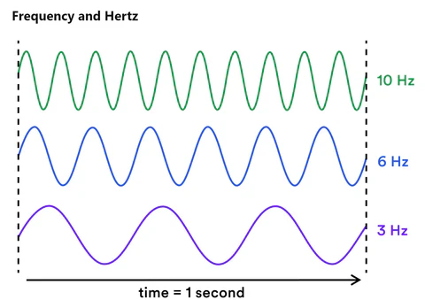

---

# Waves Are Everywhere

Many technologies use oscillating signals:

- music
- radio
- WiFi
- Bluetooth
- CPUs
- HDMI
- USB

---

# Demo: 555 Timer LED Blinker

Let's build an oscillator using the 555 timer integrated circuit.

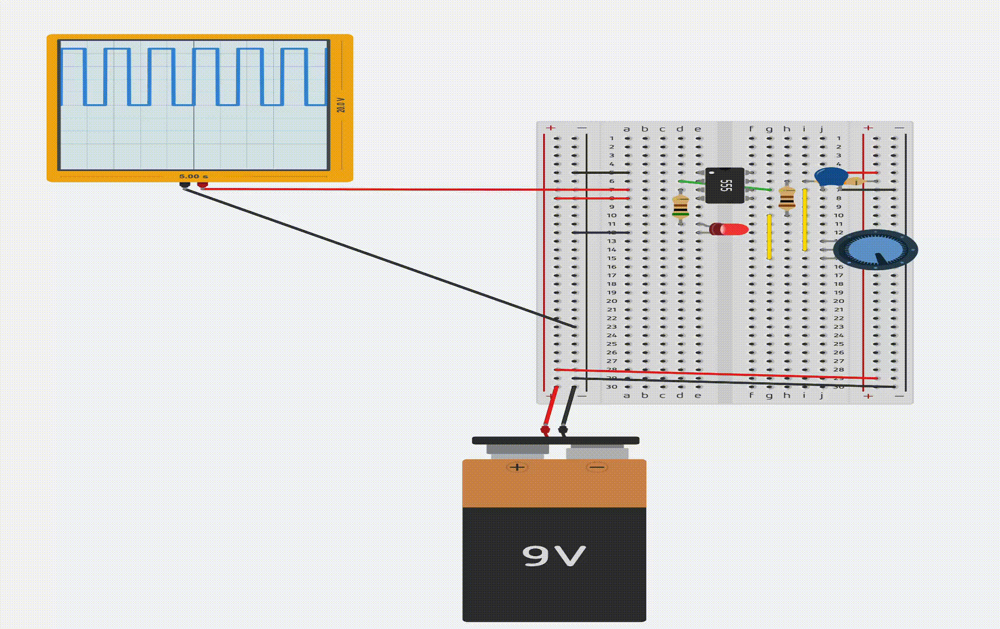

<!--

INSTRUCTOR NOTES:

Connect this back to Day 3 RC circuits.

Key insight:
The 555 automates the oscillation process.

# What Controls Blink Speed?

- Timing depends on resistor and capacitor values
- Larger values → slower oscillation
- Smaller values → faster oscillation

-->

---

# Lab Breakout #1

## 555 Timer LED Blinker Oscillator

Goal:

- Build a blinking LED oscillator

---

<!-- TODO: multimeter frequency measurement? -->

# Measure Frequency

An oscilloscope lets us SEE electrical signals.

It displays:

- voltage
- time
- wave shape
- frequency

Can also use multimeter to measure wave frequency.

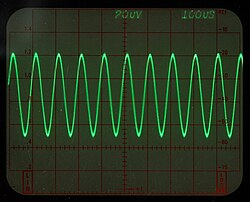

---

# Demo: Reading A Wave

Observe on the oscilloscope + multimeter:

- voltage rising/falling
- repeating square wave
- changing frequency

<!--

INSTRUCTOR NOTES:

Point out:
- horizontal axis = time
- vertical axis = voltage

Ask:
- What changes when frequency increases?
- What changes when resistance changes?

We can use the frequency tool on the multimeter

-->

---

# Sound Is A Wave

Speakers convert electrical waves into sound waves.

<!-- INSTRUCTOR NOTES

A piezo speaker vibrates rapidly when voltage changes.

Rapid vibration creates sound waves in air.

Faster oscillation → higher pitch

Slower oscillation → lower pitch

-->

---

# Demo: Changing Frequency

Changing resistance or capacitance changes:

- oscillation speed
- frequency
- sound pitch

<!--

INSTRUCTOR NOTES:

Students should hear:
- lower resistance → faster oscillation
- faster oscillation → higher pitch

Connect directly to music and instruments.

-->

---

# Demo: Electronic Piano

Build a simple tone generator using:

- 555 timer
- resistors
- capacitors
- buttons
- speaker

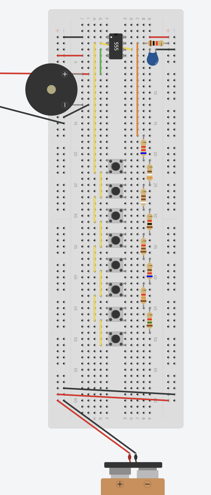

---

# Debugging Oscillator Circuits

If your circuit does NOT work:

<!-- TODO: dimple top 1 to 8 -->
- verify IC orientation
- check capacitor polarity
- inspect loose wires
- verify power rails
- test speaker separately
- verify resistor values

Timing circuits can fail subtly.

---

# Lab Breakout #2

## Electronic Piano

Goal:

- Build a simple tone generator
- Change pitch using buttons/resistors
- Observe waveform on oscilloscope

---

# Power vs Signal

Some wires provide POWER.

Some wires provide INFORMATION.

| Wire Type | Purpose |
| --- | --- |
| Power (+) | delivers energy |
| Ground (-) | return/reference |
| Data | carries information |

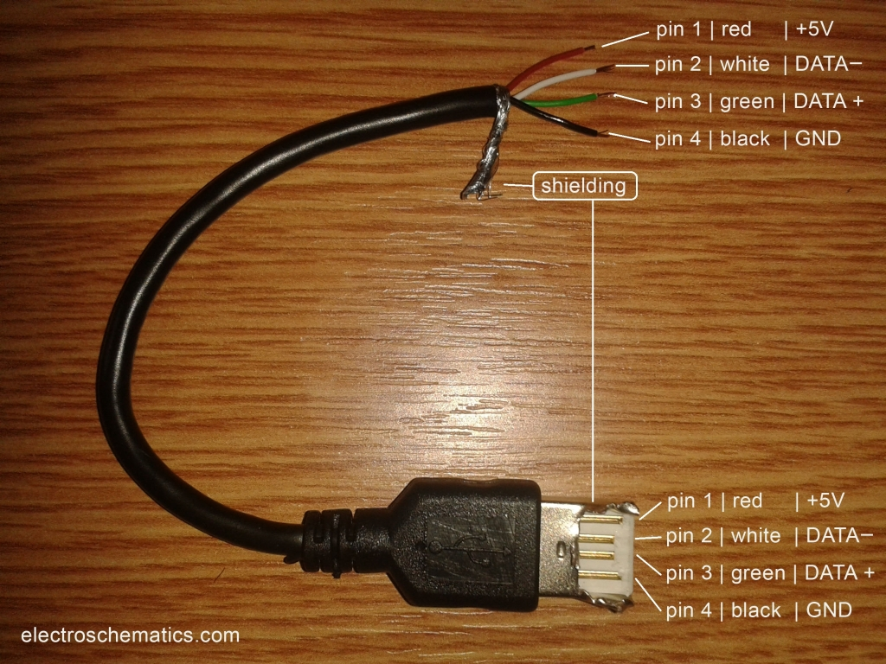

---

# Binary Signals

Digital electronics rapidly change between HIGH and LOW to send information.

| Voltage | Meaning |
| --- | --- |
| LOW | 0 |
| HIGH | 1 |

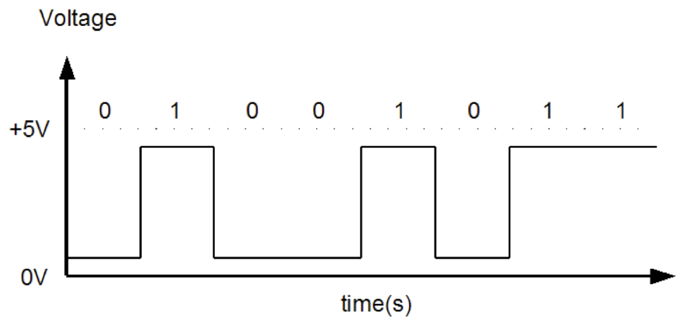

---

# Modern Electronics Use Signals

Modern computers constantly send and receive waves.

- USB
- HDMI
- Ethernet
- WiFi
- Bluetooth
- audio

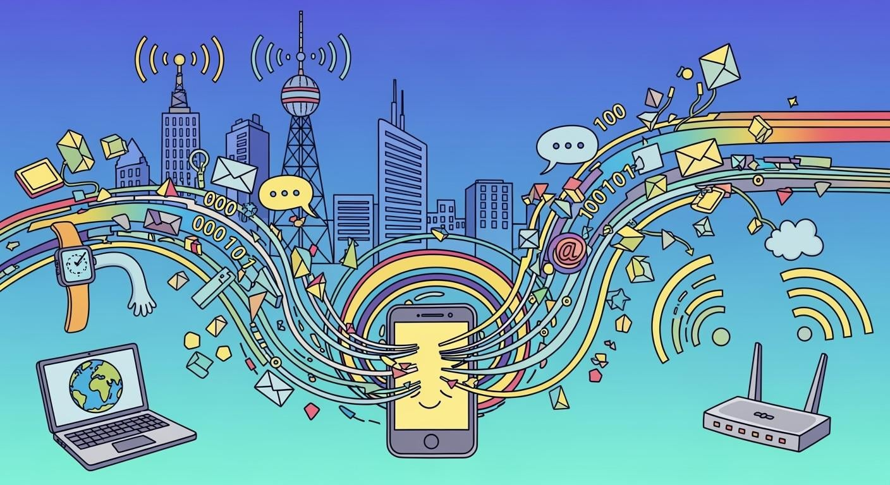

---

# Key Takeaways

<!--

- ICs combine many components into one chip
- The 555 Timer is a classic oscillator IC
- Oscilloscopes visualize electrical signals
- Oscillators generate repeating waves
- Frequency controls timing and sound pitch
- Digital systems use changing voltage signals
- Modern computers constantly generate and interpret waves

-->